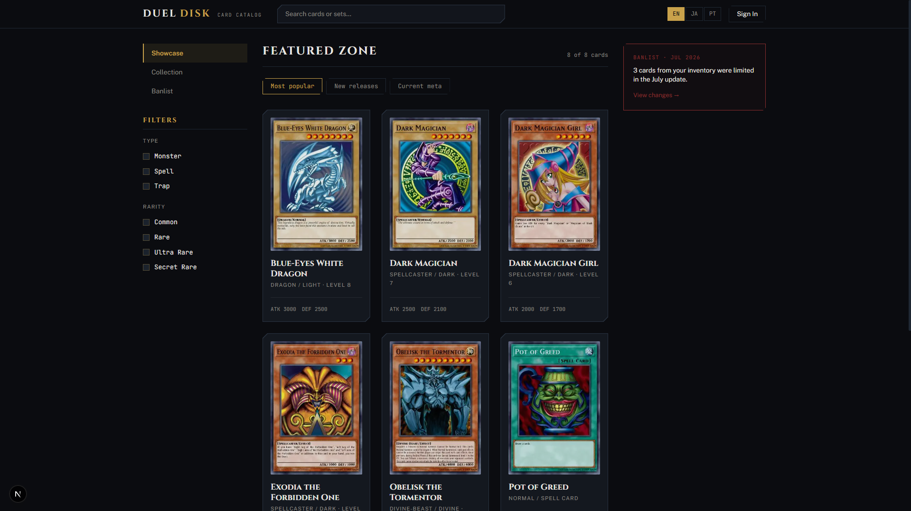
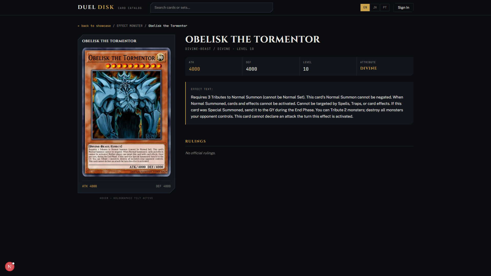

<div align="center">
  <h1 align="center">CardCodex</h1>
  <p align="center">
    A modern Yu-Gi-Oh! card catalog and showcase application built with Next.js and Prisma.
  </p>
</div>

<br />

<p align="center">
  
</p>
<p align="center">
  
</p>

## 🌟 About The Project

CardCodex is a comprehensive Yu-Gi-Oh! card catalog designed to provide a rich, interactive experience for collectors and players. It features detailed card showcases, a premium holographic tilt effect for card previews, rulings, related cards, and deck usage statistics. The application is fully localized (i18n), with English as the default locale alongside Japanese and Portuguese (pt-BR) — including per-locale routes (e.g. `/en/showcase` vs `/pt-BR/vitrine`) for better SEO.

> **Disclaimer:** This is an unofficial fan project. Yu-Gi-Oh! is a trademark of Konami. Card data and images are sourced live from the [YGOPRODeck API](https://ygoprodeck.com/api-guide/) and are neither redistributed nor stored as static assets in this repository.

## ✨ Features

- **Interactive Card Showcase:** Premium UI with holographic tilt effects (`CardTilt`) for an immersive experience.
- **Instant Card Search:** Debounced typeahead in the header and homepage — start typing a card name (in any supported language) and matching cards appear with a thumbnail preview.
- **Detailed Card Information:** Access complete stats, effects, pricing history, and community rulings.
- **Working Showcase Filters:** Filter by card type/subtype, release year, and name, combinable and paginated, all reflected in the URL.
- **Real Banlist:** TCG/OCG Forbidden/Limited/Semi-Limited lists with the same filters as the showcase, plus ban-status badges on card pages.
- **Anime Decks:** Hand-curated decklists played by characters throughout the Yu-Gi-Oh! anime, linked to the real card catalog.
- **Personal Deck Builder:** Sign in with Google to build your own Free/TCG/OCG decks from any card in the catalog — legality (copy limits, Main/Extra Deck placement) is enforced automatically, and every deck gets an unlisted shareable link.
- **Internationalization (i18n):** Full support for English (default), Japanese, and Portuguese (pt-BR) locales, with localized routes per language.
- **Automated Data Sync:** Integrates with YGOPRODeck API utilizing a Stale-While-Revalidate pattern for up-to-date pricing and data.
- **Dockerized Postgres + Production Image:** Postgres runs in Docker for local dev; a separate multi-stage `Dockerfile` builds an optimized standalone production image.

## 🛠️ Built With

This project is built using modern web development standards and technologies:

- **[Next.js 15 (App Router)](https://nextjs.org/)** - React Framework
- **[Tailwind CSS v3](https://tailwindcss.com/)** - Utility-first styling
- **[Prisma ORM](https://www.prisma.io/)** - Type-safe database interactions
- **PostgreSQL** - Relational database
- **[next-intl](https://next-intl.dev/)** - Internationalization and localized routing

## 🚀 Getting Started

To get a local copy up and running, follow these simple steps.

### Prerequisites

You need Node.js 18+ and Docker (for the local Postgres database) installed on your machine.

### Installation (Recommended: native Next.js + Dockerized Postgres)

Running `next dev` natively (instead of inside a container) avoids the CPU and I/O overhead of bind-mounting the whole repo into Docker — on Windows/macOS this overhead can be severe enough to make hot-reload compile slowly and spike host CPU, since the dev server falls back to polling the filesystem through the container's virtualized mount. Only Postgres runs in Docker; Next.js runs directly on the host.

1. Clone the repository
   ```bash
   git clone https://github.com/CaioGabriel777/Card-Codex.git
   cd Card-Codex
   ```

2. Copy the environment variables example file
   ```bash
   cp .env.example .env
   ```

3. Start the Postgres container
   ```bash
   npm run docker:up
   ```

4. Install dependencies, push the Prisma schema, and seed sample data
   ```bash
   npm install
   npm run db:push
   npm run db:seed
   ```

5. Start the Next.js dev server
   ```bash
   npm run dev
   ```

The application will now be running at `http://localhost:3000`.

To stop the database container:
```bash
npm run docker:down
```

### Fully Dockerized Alternative

If you'd rather keep everything in containers (e.g. testing on Linux, or inside WSL2's own filesystem where bind mounts are fast), you can still run the app in Docker using the production image — see [Production Docker Image](#-production-docker-image) below. It builds and serves the app rather than running `next dev`, so there's no hot-reload; rebuild the image after code changes.

## 📜 Available Scripts

In the project directory, you can run the following scripts defined in `package.json`:

| Command | Description |
|---|---|
| `npm run dev` | Starts the Next.js development server locally |
| `npm run build` | Builds the app for production |
| `npm run start` | Starts the production server |
| `npm run lint` | Runs ESLint |
| `npm run db:push` | Pushes the Prisma schema state to the database |
| `npm run db:migrate` | Creates and applies a new Prisma migration |
| `npm run db:generate` | Generates the Prisma Client |
| `npm run db:seed` | Populates the database with a handful of hand-curated sample cards (with rulings) |
| `npm run db:sync` | Syncs the **full** YGOPRODeck catalog (~14,000+ cards, EN/PT/JA) into the database |
| `npm run db:seed:decks` | Populates hand-curated anime character decklists (run `db:sync` first) |
| `npm run db:studio` | Opens Prisma Studio to view and edit database records |
| `npm run docker:up` | Starts the local Postgres container |
| `npm run docker:down` | Stops the local Postgres container |
| `npm run docker:prod:up` | Builds and starts the production image + Postgres via `docker-compose.prod.yml` |
| `npm run docker:prod:down` | Tears down the production stack |

## 🔄 Populating the Full Card Catalog

`npm run db:seed` only loads 8 sample cards (with hand-written rulings, meant for local development/demos). To populate the real catalog:

```bash
npm run db:sync
```

`prisma/sync.ts` pulls the entire YGOPRODeck database in 3 bulk requests (English, Portuguese, Japanese — ~14,000+ cards each) and upserts everything by `ygoprodeckId`. It's safe to re-run any time to pick up new card releases or corrections; it never touches rulings or deck-usage data, so anything seeded by hand survives a re-sync. Rulings and deck-usage stats aren't available from YGOPRODeck's API and stay empty for synced cards unless curated separately.

## 🃏 Anime Decks

`/decks` shows decklists actually played by characters in the Yu-Gi-Oh! anime (e.g. Yugi Muto's Season 1 deck). There's no API for this — it's hand-curated in `prisma/seedAnimeDecks.ts`, cross-referenced against wiki/community sources, then matched to real cards already in the database:

```bash
npm run db:sync         # cards must exist first
npm run db:seed:decks
```

To add another deck, append a `DeckDefinition` to the `DECKS` array in `prisma/seedAnimeDecks.ts` and re-run the script — it upserts by slug and warns (without failing) about any card name it can't match.

## 🔑 Personal Deck Builder (Google Sign-In)

`/collection` lets signed-in users build their own decks (Free/TCG/OCG legality enforced server-side) from any card in the catalog, via the "+" button that appears on card thumbnails on hover. Auth is [Auth.js](https://authjs.dev/) with the Google provider and the Prisma adapter (sessions/decks live in the same Postgres database as everything else).

Out of the box, `.env` has **placeholder** Google credentials — sign-in is fully wired up (you can click through to Google's OAuth screen) but will fail after redirecting back, since the client ID/secret aren't real. To make it actually work:

1. Create an OAuth Client ID (Web application) at the [Google Cloud Console credentials page](https://console.cloud.google.com/apis/credentials).
2. Add an authorized redirect URI: `<your-site-url>/api/auth/callback/google` (e.g. `http://localhost:3000/api/auth/callback/google` for local dev).
3. Set `AUTH_GOOGLE_ID` and `AUTH_GOOGLE_SECRET` in `.env` (or your deployment's env vars) to the real values.
4. Generate a real `AUTH_SECRET` if you haven't already:
   ```bash
   node -e "console.log(require('crypto').randomBytes(32).toString('base64'))"
   ```

None of this needs code changes — it's read entirely from environment variables (see `.env.example`), so it deploys the same way on Vercel: add the three vars in the project's environment variable settings.

## 🐳 Production Docker Image

`Dockerfile` is a multi-stage build that compiles the app with `next build` (using Next's [`standalone` output](https://nextjs.org/docs/app/api-reference/config/next-config-js/output)) and ships a minimal runtime image — no dev dependencies, no source-watching, no Prisma CLI. This is what you'd deploy, not what you develop against.

Unlike the dev `docker-compose.yml`, this stack has no hardcoded database password. Set a real one in `.env` first — `docker-compose.prod.yml` refuses to start without it:
```bash
echo 'POSTGRES_PASSWORD=<a strong random value>' >> .env
npm run docker:prod:up
```

Before the first boot, apply the Prisma schema to the target database (the runtime image intentionally doesn't bundle the Prisma CLI to stay small), using the same credentials you just set:
```bash
DATABASE_URL=postgresql://cardcodex:<your POSTGRES_PASSWORD>@localhost:5432/cardcodex?schema=public npx prisma db push
```

## 🤝 Contributing

Contributions are what make the open source community such an amazing place to learn, inspire, and create. Any contributions you make are **greatly appreciated**.

1. Fork the Project
2. Create your Feature Branch (`git checkout -b feature/AmazingFeature`)
3. Commit your Changes (`git commit -m 'Add some AmazingFeature'`)
4. Push to the Branch (`git push origin feature/AmazingFeature`)
5. Open a Pull Request

## 📄 License

Distributed under the [PolyForm Shield 1.0.0](./LICENSE) License. You are free to read, run, and modify this code for any purpose that doesn't compete with the product this repository provides.

## 🙏 Acknowledgements

- Data provided by the amazing [YGOPRODeck API](https://ygoprodeck.com/).
